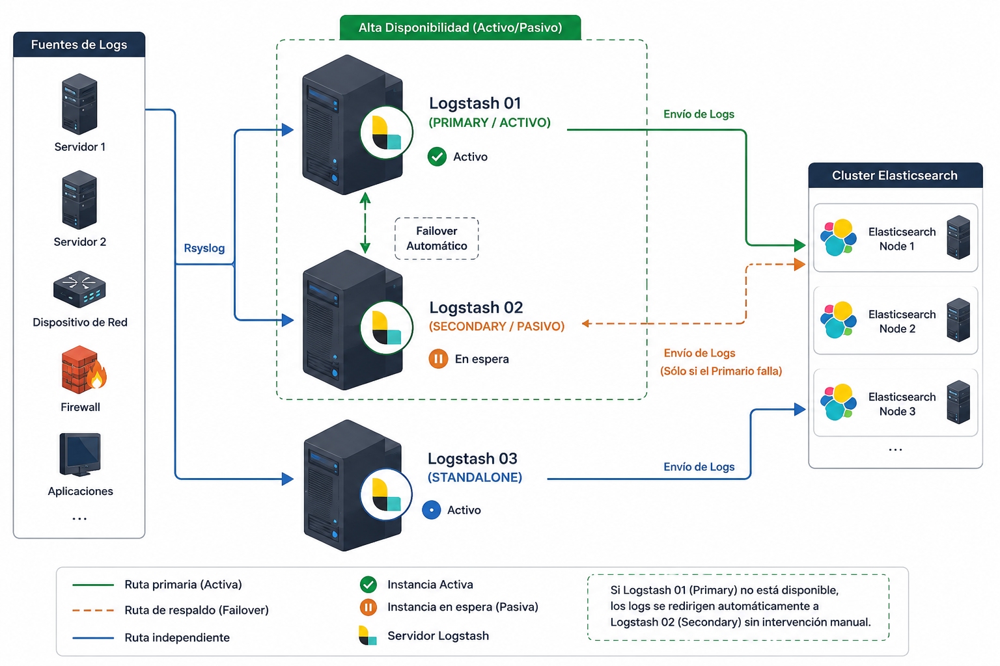

:::cover
client=SERMAS
subtitle=Documentación final de arquitectura
company=Inetum
status=Proyecto finalizado
date=Junio 2026
version=1.0
:::

# Arquitectura de la Plataforma Elastic

## Introducción

Este documento describe la arquitectura de la plataforma Elastic instalada para SERMAS.

:::architecture
title=Arquitectura General
environment=Producción
nodes=16
security=Habilitada
monitoring=Habilitado
:::

## Función de cada tipo de nodo

:::component
type=master
:::

:::component
type=hot
:::

:::component
type=cold
:::

:::component
type=frozen
:::

:::component
type=ml
:::

:::component
type=fleet
:::

:::component
type=logstash
:::

:::component
type=kibana
:::

## Cluster

:::cluster
title=Cluster Elastic SERMAS
master=3
hot=2
cold=3
frozen=1
ml=2
kibana=2
fleet=2
logstash=1
:::

## elasticsearch.yml

```yaml
cluster.name: sermas
node.name: elastic-master01
network.host: 172.29.80.87
xpack.security.enabled: true
```

## Logstash

```ruby
input {

  udp {

    port => 514

  }

}
```

## API

```json
{
  "cluster_name": "sermas",
  "status": "green"
}
```

## Versiones

:::version
elasticsearch=8.11.0
kibana=8.11.0
logstash=8.19.5
fleet=8.11.0
agent=8.11.0
:::

## Nodo Maestro

:::node
hostname=elastic-master01
role=Master
ip=10.10.10.10
ram=8 GB
cpu=4 vCPU
disk=100 GB
os=RHEL 9
:::

## Servidor

:::server
hostname=srv-elastic01
environment=Producción
os=RHEL 9
cpu=8 vCPU
ram=32 GB
storage=500 GB
ip=10.10.10.20
:::

## Topología

:::topology
environment=Producción
sites=2
nodes=16
:::

# LOGSTASH

## Arquitectura General

La siguiente imagen muestra la arquitectura implementada.



## Introducción

Después de realizar todas las pruebas de validación del servicio, permisos, pipelines básicos y conectividad hacia Elasticsearch, se procede a realizar la integración de las diferentes tecnologías.

En este caso se implementa una arquitectura de pipelines distribuidos utilizando el plugin `pipeline`, permitiendo separar el procesamiento por tecnología y facilitando:

- Escalabilidad
- Mantenimiento
- Troubleshooting
- Separación lógica de flujos
- Procesamiento independiente
- Integraciones multi-tecnología

> Esta arquitectura permite escalar cada tecnología de forma independiente.

**Importante:** Todos los pipelines deben validar correctamente antes de pasar a producción.

## Arquitectura

:::architecture
title=Arquitectura Logstash
environment=Producción
nodes=1
security=Habilitada
monitoring=Habilitado
:::

## Servidor

:::server
hostname=logstash01
environment=Producción
os=RHEL 9
cpu=8 vCPU
ram=16 GB
storage=500 GB
ip=172.29.xx.xx
:::

## Instalación de Logstash RPM

### Conexión SSH

```bash
ssh elastic@IP
```

### Credenciales

#### Usuario

```text
elastic
```

#### Password

```text
PAS
```

## Instalación del RPM

### Ir a la ruta donde está el RPM

```bash
cd /tmp/
```

### Validar que el RPM exista

```bash
ll logstash-9.3.1-x86_64.rpm
```

### Resultado esperado

```bash
-rw-r--r--. 1 root root XXXXXXXX fecha logstash-9.3.1-x86_64.rpm
```

## Instalar Logstash

```bash
sudo rpm -ivh logstash-9.3.1-x86_64.rpm
```

### Explicación de parámetros

| Parámetro | Descripción      |
| --------- | ---------------- |
| -i        | Instala          |
| -v        | Modo verbose     |
| -h        | Muestra progreso |

## Validación del Servicio

### Validar estado del servicio

```bash
systemctl status logstash.service
```

### Resultado esperado

#### Servicio detenido

```bash
● logstash.service - logstash
   Loaded: loaded (/usr/lib/systemd/system/logstash.service; enabled)
   Active: inactive (dead)
```

#### Servicio iniciado

```bash
● logstash.service - logstash
   Loaded: loaded (/usr/lib/systemd/system/logstash.service; enabled)
   Active: active (running)
```

### Directorios de Configuración

#### Ir a configuración de Logstash

```bash
cd /etc/logstash/
```

#### Validar contenido

```bash
ll
```

#### Resultado esperado

```bash
conf.d/
jvm.options
log4j2.properties
logstash.yml
pipelines.yml
startup.options
```

### Ir al directorio de pipelines

```bash
cd /etc/logstash/conf.d
```

> Aquí se almacenan los archivos `.conf`.

### Logs de Logstash

#### Ir a directorio de logs

```bash
cd /var/log/logstash
```

### Validación de Permisos

#### Validar permisos actuales

```bash
ll -d /var/log/logstash
```

#### Usuario y Grupo Correctos

```text
logstash:logstash
```

#### Cambiar owner y grupo

```bash
sudo chown -R logstash:logstash /var/log/logstash
sudo chown -R logstash:logstash /etc/logstash
```

### Permisos Recomendados

#### Permisos para directorios

```bash
sudo find /var/log/logstash -type d -exec chmod 774 {} \;
sudo find /etc/logstash/conf.d -type d -exec chmod 774 {} \;
```

#### Permisos para archivos

```bash
sudo find /var/log/logstash -type f -exec chmod 664 {} \;
sudo find /etc/logstash/conf.d/*.conf -type f -exec chmod 664 {} \;
```

### Explicación de Permisos

#### Permiso 664

```text
664 = rw-rw-r--
```

| Usuario | Permisos            |
| ------- | ------------------- |
| Owner   | Lectura + Escritura |
| Grupo   | Lectura + Escritura |
| Otros   | Solo lectura        |

#### Permiso 744

```text
774 = rwxrwxr--
```

| Usuario | Permisos                        |
| ------- | ------------------------------- |
| Owner   | Lectura + Escritura + Ejecución |
| Grupo   | Lectura + Escritura + Ejecución |
| Otros   | Solo lectura                    |

> Los directorios necesitan permiso de ejecución para poder acceder a ellos.

#### Agregar Usuario elastic al Grupo logstash

```bash
sudo usermod -aG logstash elastic
```

#### Validar grupos del usuario

```bash
groups elastic
```

#### Resultado esperado

```bash
elastic wheel logstash
```

### Validación Manual de Logstash

#### 0. Comando de prueba

```bash
/usr/share/logstash/bin/logstash --path.settings /etc/logstash -e 'input { stdin { } } output { stdout { codec => rubydebug } }'
```

#### ¿Para qué sirve este comando?

Este comando permite validar:

- Funcionamiento de Java
- Arranque de Logstash
- Compilación del pipeline
- Funcionamiento de plugins
- Validación de permisos
- Validación del path.settings
- Correcta instalación de Logstash

### Validación Manual de Logstash con User Logstash

#### 0. Comando de prueba

```bash
sudo -u logstash -- /usr/share/logstash/bin/logstash --path.settings /etc/logstash -e 'input { stdin { } } output { stdout { codec => rubydebug } }'
```

#### 1. Ejecutar como usuario logstash

```bash
sudo -u logstash --
```

Significa:

> "Ejecuta el siguiente comando usando el usuario `logstash`"

NO se ejecuta como root.

> ¿Por qué esto es importante?

Porque el servicio de Logstash en producción NO corre como root.

Corre como:

```bash
logstash:logstash
```

Entonces este comando permite validar:

- permisos reales
- acceso a logs
- acceso a pipelines
- acceso a certificados
- acceso a colas
- acceso a plugins
- acceso a sincedb

#### 2. Ejecutable de Logstash

```bash
/usr/share/logstash/bin/logstash
```

Es el binario principal de Logstash.

#### 3. Path de configuración

```bash
--path.settings /etc/logstash
```

Le indica dónde están:

- `logstash.yml`
- `pipelines.yml`
- `jvm.options`
- configuraciones globales

#### 4. Pipeline inline temporal

```bash
-e 'input { stdin { } } output { stdout { codec => rubydebug } }'
```

Crea un pipeline temporal en memoria.

NO usa archivos `.conf`.

> ¿Qué hace ese pipeline?

#### Input

```bash
stdin
```

Lee lo que escribes por teclado.

#### Output

```json
stdout { codec => rubydebug }
```

Imprime eventos parseados en consola.

#### Flujo completo

Tú escribes:

```bash
hola
```

Logstash procesa el evento y responde:

```json
{
      "message" => "hola",
     "@version" => "1",
   "@timestamp" => 2026-05-28T00:00:00.000Z,
         "host" => "server"
}
```

> ¿Qué valida realmente este comando?

#### Validaciones críticas

| Validación    | Qué revisa                    |
| ------------- | ----------------------------- |
| Usuario       | Que `logstash` puede ejecutar |
| Permisos      | Lectura/escritura reales      |
| Java          | JVM funcionando               |
| Pipeline      | Compilación correcta          |
| Plugins       | Carga de plugins              |
| Configuración | `/etc/logstash` correcto      |
| Logs          | Acceso a `/var/log/logstash`  |
| Queue         | Acceso a `path.data`          |
| Certificados  | Lectura de `.pem` o `.p12`    |
| Sincedb       | Escritura de estados          |

> ¿Por qué es mejor que ejecutarlo normal?

Porque si haces:

```bash
/usr/share/logstash/bin/logstash ...
```

lo ejecutas con TU usuario actual.

Tal vez tu usuario sí tiene permisos, pero `logstash` no.

Entonces el servicio podría fallar aunque la prueba manual funcione.

### Problemas que detecta este comando: Ejemplos reales

#### Permission denied

```bash
Permission denied - /var/log/logstash
```

#### Certificados inaccesibles

```bash
Could not read certificate
```

#### Sin permisos sobre pipeline

```bash
Cannot load pipeline configuration
```

#### Error en path.data

```bash
Path "/var/lib/logstash" must be writable
```

#### ¿Por qué esto es importante?

Porque el servicio de Logstash en producción NO corre como root.

Corre como:

```bash
logstash:logstash
```

Entonces este comando permite validar:

- Permisos reales
- Acceso a logs
- Acceso a pipelines
- Acceso a certificados
- Acceso a colas
- Acceso a plugins
- Acceso a sincedb

#### ¿Para qué sirve este comando?

Este comando permite validar:

- Funcionamiento de Java
- Arranque de Logstash
- Compilación del pipeline
- Funcionamiento de plugins
- Validación de permisos
- Validación del path.settings
- Correcta instalación de Logstash

### Validar Configuración antes de iniciar servicio

#### Validación recomendada

```bash
/usr/share/logstash/bin/logstash --path.settings /etc/logstash --config.test_and_exit
```

#### Resultado esperado

```text
Configuration OK
```

### Validación de Pipeline Logstash: Crear Pipeline de Prueba

#### Ir a la ruta de pipelines

```bash
cd /etc/logstash/conf.d/
```

#### Crear archivo de configuración

```bash
vi test_logstash.conf
```

#### Configuración de prueba hacia archivo local

```ruby
input {
  generator {
    message => "prueba pipeline logstash"
    count => 5
  }
}

filter {
  mutate {
    add_field => {
      "entorno" => "test"
      "origen" => "generator"
    }
  }
}

output {
  file {
    path => "/tmp/logstash-generator-test.json"
    codec => json_lines
  }
}
```

### Explicación del Pipeline

#### Input Generator

```ruby
generator
```

Plugin utilizado para generar eventos de prueba automáticamente.

#### Parámetros

| Parámetro | Descripción         |
| --------- | ------------------- |
| message   | Mensaje generado    |
| count     | Cantidad de eventos |

#### Filter Mutate

```ruby
mutate
```

Permite modificar eventos.

En este caso agrega campos personalizados.

#### Campos agregados

| Campo   | Valor     |
| ------- | --------- |
| entorno | test      |
| origen  | generator |

#### Output File

```ruby
file
```

Guarda eventos procesados en un archivo local.

#### Archivo generado

```bash
/tmp/logstash-generator-test.json
```

#### Codec utilizado

```ruby
json_lines
```

Genera una línea JSON por evento.

#### Validar configuración antes de ejecutar

```bash
sudo -u logstash -- /usr/share/logstash/bin/logstash \
--path.settings /etc/logstash \
--config.test_and_exit
```

#### Resultado esperado

```text
Configuration OK
```

#### Ejecutar pipeline manualmente

```bash
sudo -u logstash -- /usr/share/logstash/bin/logstash \
--path.settings /etc/logstash
```

#### Validar archivo generado

```bash
cat /tmp/logstash-generator-test.json
```

#### Resultado esperado

```json
{
  "message": "prueba pipeline logstash",
  "entorno": "test",
  "origen": "generator"
}
```

### Validar múltiples eventos

```bash
wc -l /tmp/logstash-generator-test.json
```

#### Resultado esperado

```text
5
```

Porque el generator crea:

```ruby
count => 5
```

### Pipeline hacia Elasticsearch

#### Editar archivo

```bash
vi /etc/logstash/conf.d/test_logstash.conf
```

#### Configuración Elasticsearch Output

```ruby
input {
  generator {
    message => "prueba pipeline logstash"
    count => 0
  }
}

filter {
  mutate {
    add_field => {
      "entorno" => "test"
      "origen" => "generator"
    }
  }
}

output {
  elasticsearch {
    hosts => ["https://172.29.80.96:9200","https://172.29.80.97:9200"]
    index => "logstash-generator-test"
    api_key => "${ES_API_KEY_SYSLOG}"
    ssl_enabled => true
    ssl_verification_mode => "none"
  }
}
```

### Explicación del Output Elasticsearch

#### Hosts

```ruby
hosts
```

Lista de nodos de Elasticsearch.

Se recomienda mínimo 2 hosts para alta disponibilidad.

#### Índice destino

```ruby
index => "logstash-generator-test"
```

Índice donde se almacenarán los eventos.

#### Usuario y Password

```ruby
api_key
```

Credenciales de autenticación.

#### SSL Enabled

```ruby
ssl_enabled => true
```

Habilita conexión HTTPS/TLS.

#### SSL Verification Mode

```ruby
ssl_verification_mode => "none"
```

Deshabilita validación del certificado SSL.

> Solo recomendado para ambientes de laboratorio o pruebas.

#### Recomendación Productiva

NO utilizar:

```ruby
ssl_verification_mode => "none"
```

En producción utilizar:

```ruby
ssl_certificate_authorities
```

o certificados válidos.

### Validar configuración

```bash
sudo -u logstash -- /usr/share/logstash/bin/logstash \
--path.settings /etc/logstash \
--config.test_and_exit
```

#### Iniciar servicio

```bash
sudo systemctl restart logstash
```

#### Validar estado

```bash
systemctl status logstash
```

#### Validar logs en tiempo real

```bash
tail -f /var/log/logstash/logstash-plain.log
```

### Validar indexación en Elasticsearch

#### Desde Kibana Dev Tools

```json
GET logstash-generator-test/_search
```

#### Resultado esperado

Eventos indexados correctamente:

```json
{
  "hits": {
    "hits": [
      {
        "_source": {
          "message": "prueba pipeline logstash",
          "entorno": "test",
          "origen": "generator"
        }
      }
    ]
  }
}
```

### Validar índice creado

```json
GET _cat/indices/logstash-generator-test?v
```

## Configuración de Capabilities para Puerto 514 en Logstash

### Introducción

En Linux, los puertos menores a `1024` son considerados puertos privilegiados.

El puerto Syslog tradicional:

```text
514
```

requiere privilegios especiales para poder ser utilizado por aplicaciones que NO corren como usuario root.

En el caso de Logstash, el servicio normalmente se ejecuta con el usuario:

```text
logstash
```

por lo tanto fue necesario realizar una modificación en el servicio systemd para permitir que Logstash pueda escuchar el puerto Syslog 514 sin ejecutar el servicio como root.

### Ruta Modificada

La modificación fue aplicada sobre el servicio systemd de Logstash ubicado en:

```bash
/usr/lib/systemd/system/logstash.service
```

### Configuración Aplicada

#### Editar servicio

```bash
sudo vi /usr/lib/systemd/system/logstash.service
```

### Configuración agregada

```ini
[Service]
AmbientCapabilities=CAP_NET_BIND_SERVICE
CapabilityBoundingSet=CAP_NET_BIND_SERVICE
```

### Explicación de la Configuración

#### AmbientCapabilities

```ini
AmbientCapabilities=CAP_NET_BIND_SERVICE
```

Permite que el proceso Logstash pueda abrir puertos privilegiados sin ejecutarse como root.

### CapabilityBoundingSet

```ini
CapabilityBoundingSet=CAP_NET_BIND_SERVICE
```

Limita las capacidades disponibles únicamente a:

```text
CAP_NET_BIND_SERVICE
```

Esto mejora la seguridad del servicio.

### ¿Para qué sirve CAP_NET_BIND_SERVICE?

La capability:

```text
CAP_NET_BIND_SERVICE
```

permite abrir puertos menores a:

```text
1024
```

por ejemplo:

| Puerto | Servicio   |
| ------ | ---------- |
| 80     | HTTP       |
| 443    | HTTPS      |
| 514    | Syslog     |
| 6514   | Syslog TLS |

### Problema Solucionado

Sin esta configuración Logstash genera errores similares a:

```text
Permission denied
```

o:

```text
Cannot assign requested address
```

al intentar escuchar el puerto:

```ruby
port => 514
```

### Aplicar cambios

#### Recargar systemd

```bash
sudo systemctl daemon-reload
```

#### Validar puerto 514

```bash
ss -tulpn | grep 514
```

#### Resultado esperado

```bash
udp   UNCONN   0   0   0.0.0.0:514
```

#### Validar configuración aplicada

```bash
systemctl cat logstash
```

#### Validar capabilities activas

```bash
systemctl show logstash | grep Capability
```

### Importante

Esta configuración solo es necesaria cuando Logstash utiliza puertos privilegiados como:

```ruby
port => 514
```

## Buenas prácticas

### Mantener un pipeline por archivo

Ejemplo:

```text
10-input.conf
20-filter.conf
30-output.conf
```

## Recomendaciones de Seguridad

| Configuración          | Recomendación      |
| ---------------------- | ------------------ |
| ssl_verification_mode  | full               |
| Passwords hardcodeados | Evitar             |
| Certificados           | Utilizar CA válida |
| Usuario Elasticsearch  | Permisos mínimos   |

## Validaciones profesionales recomendadas

### Validar permisos

```bash
sudo -u logstash -- cat /etc/logstash/conf.d/test_logstash.conf
```

### Validar acceso Elasticsearch

```bash
curl -k -u TU_USUARIO:TU_PASSWORD https://TU_HOST_ES:9200
```

## Errores comunes

| Error                     | Causa                        |
| ------------------------- | ---------------------------- |
| Connection refused        | Elasticsearch apagado        |
| PKIX path building failed | Problema certificados        |
| Permission denied         | Permisos incorrectos         |
| Pipeline aborted          | Error sintaxis               |
| Unauthorized              | Usuario/password incorrectos |

## Comando recomendado de troubleshooting

```bash
sudo -u logstash -- /usr/share/logstash/bin/logstash \
--path.settings /etc/logstash \
--log.level debug
```

### Iniciar Servicio

```bash
sudo systemctl start logstash
```

### Habilitar inicio automático

```bash
sudo systemctl enable logstash
```

### Validar logs en tiempo real

```bash
tail -f /var/log/logstash/logstash-plain.log
```

## Validar puertos

### Con ss

```bash
ss -tulpn | grep java
```

### Con netstat

```bash
netstat -tulpn | grep java
```

### Reiniciar Servicio

```bash
sudo systemctl restart logstash
```

## Validar consumo de recursos

### Con top

```bash
top
```

### Con htop

```bash
htop
```

### Validar proceso JVM

```bash
ps -ef | grep logstash
```

## Recomendaciones Productivas

### Evitar uso de root

Mantener permisos adecuados:

| Ruta              | Permisos          |
| ----------------- | ----------------- |
| /etc/logstash     | 775               |
| \*.conf           | 664               |
| /var/log/logstash | logstash:logstash |

## Errores comunes evitados

- permission denied
- cannot create queue
- cannot write sincedb
- failed to open log file
- dead letter queue errors
- pipeline terminated
- plugin initialization failed

## Estructura de Archivos

```text
/etc/logstash/conf.d/

00-input-syslog.conf
10-hitachi.conf
90-desconocido.conf
```

## Pipeline Principal Syslog Router

### Archivo

```text
00-input-syslog.conf
```

#### Configuración

```ruby
input {
  syslog {
    id => "syslog_514_router"
    host => "0.0.0.0"
    port => 514
  }
}

filter {

  if [host][ip] in ["172.29.16.160", "172.29.16.161", "172.29.16.162", "172.29.16.163", "172.29.16.164", "172.29.16.165"] {
    mutate {
      add_field => {
        "tecnologia" => "hitachi"
      }
    }

  } else {

    mutate {
      add_field => {
        "tecnologia" => "desconocido"
      }
    }

  }

}

output {

  if [tecnologia] == "hitachi" {

    pipeline {
      send_to => "hitachi"
    }

  } else {

    pipeline {
      send_to => "desconocido"
    }

  }

}
```

### Explicación del Pipeline Router

#### Input Syslog

El pipeline escucha eventos Syslog en el puerto:

```text
514
```

desde cualquier interfaz:

```text
0.0.0.0
```

#### Identificación de Tecnología

Se realiza validación de la IP origen:

```ruby
if [host][ip] in [...]
```

Dependiendo de la IP se agrega el campo:

```ruby
tecnologia
```

#### Tecnologías configuradas

| IP            | Tecnología |
| ------------- | ---------- |
| 172.29.16.160 | hitachi    |
| 172.29.16.161 | hitachi    |
| 172.29.16.162 | hitachi    |
| 172.29.16.163 | hitachi    |
| 172.29.16.164 | hitachi    |
| 172.29.16.165 | hitachi    |

#### Eventos Desconocidos

Cualquier evento que no coincida con las IP configuradas será marcado como:

```text
desconocido
```

Esto permite:

- identificar nuevas fuentes
- detectar equipos no inventariados
- evitar pérdida de eventos
- facilitar troubleshooting

#### Redirección mediante Pipelines

Se utiliza el plugin:

```ruby
pipeline
```

para enviar eventos internamente hacia otros pipelines.

### Pipeline Tecnología Hitachi

#### Archivo

```text
10-hitachi.conf
```

#### Configuración

```ruby
input {
  pipeline {
    address => "hitachi"
  }
}

filter {

  mutate {
    add_field => {
      "[event][dataset]" => "hitachi"
    }
  }

}

output {

  elasticsearch {
    hosts => ["https://172.29.80.96:9200", "https://172.29.80.97:9200"]
    data_stream => true
    data_stream_type => "logs"
    data_stream_dataset => "hitachi"
    data_stream_namespace => "default"
    api_key => "${ES_API_KEY_SYSLOG}"
    ssl_enabled => true
    ssl_verification_mode => "none"
  }

}
```

### Explicación Pipeline Hitachi

#### Input Pipeline

Recibe únicamente eventos enviados desde:

```ruby
send_to => "hitachi"
```

#### Event Dataset

Se agrega:

```ruby
[event][dataset] => "hitachi"
```

Este campo es utilizado por Elasticsearch y Kibana para:

- Data Streams
- Integraciones
- Dashboards
- Data Views
- ECS normalization

#### Data Stream

Los eventos son enviados al Data Stream:

```text
logs-hitachi-default
```

#### Ventajas de Data Streams

- ILM automático
- rollover automático
- mejor rendimiento
- manejo eficiente de índices
- integración nativa con Elastic

### Pipeline Eventos Desconocidos

#### Archivo

```text
90-desconocido.conf
```

#### Configuración

```ruby
input {
  pipeline {
    address => "desconocido"
  }
}

filter {

  mutate {
    add_field => {
      "[event][dataset]" => "desconocido"
    }
  }

}

output {

  elasticsearch {
    hosts => ["https://172.29.80.96:9200", "https://172.29.80.97:9200"]
    data_stream => true
    data_stream_type => "logs"
    data_stream_dataset => "desconocido"
    data_stream_namespace => "default"
    api_key => "${ES_API_KEY_SYSLOG}"
    ssl_enabled => true
    ssl_verification_mode => "none"
  }

}
```

#### Objetivo del Pipeline Desconocido

Este pipeline permite almacenar eventos no clasificados para:

- análisis posterior
- identificación de nuevas integraciones
- validación de inventario
- troubleshooting
- onboarding de nuevas tecnologías

### Configuración pipelines.yml

#### Archivo

```text
/etc/logstash/pipelines.yml
```

#### Configuración

```yaml
- pipeline.id: syslog-router
  path.config: "/etc/logstash/conf.d/00-input-syslog.conf"

- pipeline.id: syslog-hitachi
  path.config: "/etc/logstash/conf.d/10-hitachi.conf"

- pipeline.id: desconocido
  path.config: "/etc/logstash/conf.d/90-desconocido.conf"
```

#### Explicación pipelines.yml

Cada entrada define:

| Parámetro   | Descripción                |
| ----------- | -------------------------- |
| pipeline.id | Nombre lógico del pipeline |
| path.config | Ruta del archivo `.conf`   |

#### Ventajas de Multipipeline

- Separación de flujos
- Mejor rendimiento
- Troubleshooting independiente
- Escalabilidad
- Mantenimiento simplificado
- Evita pipelines monolíticos

### Validación de Configuración

#### Validar sintaxis

```bash
sudo -u logstash -- /usr/share/logstash/bin/logstash \
--path.settings /etc/logstash \
--config.test_and_exit
```

#### Resultado esperado

```text
Configuration OK
```

#### Reiniciar servicio

```bash
sudo systemctl restart logstash
```

#### Validar estado

```bash
systemctl status logstash
```

#### Validar logs

```bash
tail -f /var/log/logstash/logstash-plain.log
```

#### Validar pipelines activos

```bash
curl -X GET localhost:9600/_node/pipelines?pretty
```

### Buenas prácticas recomendadas

#### Nomenclatura de archivos

| Prefijo | Uso                     |
| ------- | ----------------------- |
| 00      | Inputs                  |
| 10-50   | Tecnologías             |
| 90      | Fallback / desconocidos |

### Recomendaciones de Seguridad

#### Producción

Evitar:

```ruby
ssl_verification_mode => "none"
```

Utilizar certificados válidos y autoridades certificadoras.

### Recomendaciones adicionales

- Utilizar API Keys dedicadas
- Separar pipelines por tecnología
- Mantener Data Streams independientes
- Implementar ILM
- Activar Dead Letter Queue
- Monitorear pipelines desde Kibana

### Troubleshooting

#### Validar puertos

```bash
ss -tulpn | grep 514
```

### Validar conectividad Elasticsearch

```bash
curl -k https://ip:9200
```

### Errores comunes

| Error                  | Posible causa             |
| ---------------------- | ------------------------- |
| Address already in use | Puerto 514 ocupado        |
| Permission denied      | Permisos insuficientes    |
| Pipeline aborted       | Error sintaxis            |
| Connection refused     | Elasticsearch inaccesible |
| Unauthorized           | API Key inválida          |
| SSLHandshakeException  | Problemas TLS             |

### Validación de Tráfico Syslog con tcpdump

#### Introducción

La herramienta `tcpdump` permite capturar y analizar tráfico de red en tiempo real.

En ambientes con Logstash y Syslog es una de las herramientas más importantes para troubleshooting, ya que permite validar si los eventos realmente están llegando al servidor antes de ser procesados por Logstash.

#### Comando de Validación

```bash
sudo tcpdump -i any udp port 514 and host 172.29.16.160
```

#### Explicación del Comando

| Parámetro | Descripción                           |
| --------- | ------------------------------------- |
| sudo      | Ejecuta el comando como administrador |
| tcpdump   | Herramienta de captura de paquetes    |
| -i any    | Escucha en todas las interfaces       |
| udp       | Filtra tráfico UDP                    |
| port 514  | Filtra puerto Syslog                  |
| and host  | Filtra una IP específica              |

#### ¿Qué valida este comando?

Permite verificar:

- Llegada de logs Syslog
- Conectividad de red
- Configuración del dispositivo origen
- Firewall
- Routing
- ACLs
- NAT
- Configuración del puerto Syslog

#### Puerto Syslog

El puerto tradicional Syslog es:

```text
UDP 514
```

#### Funcionamiento

El comando captura únicamente tráfico:

- UDP
- puerto 514
- relacionado con la IP indicada

#### Ejemplo de Resultado Esperado

```bash
14:32:10 IP 10.10.10.5.514 > servidor.514: SYSLOG local7.info, length: 120
```

#### Interpretación

| Campo      | Descripción        |
| ---------- | ------------------ |
| 10.10.10.5 | Equipo origen      |
| 514        | Puerto Syslog      |
| SYSLOG     | Tipo de tráfico    |
| length     | Tamaño del paquete |

### Problemas que ayuda a identificar

| Problema             | Descripción                       |
| -------------------- | --------------------------------- |
| Firewall bloqueando  | No llegan paquetes                |
| Equipo no envía logs | Sin tráfico                       |
| Puerto incorrecto    | Syslog configurado en otro puerto |
| Problema de routing  | Tráfico no llega                  |
| ACL de red           | Bloqueo intermedio                |
| NAT incorrecto       | Traducción errónea                |

### Validación Básica Syslog

#### Capturar todo el tráfico Syslog

```bash
sudo tcpdump -i any port 514
```

#### Validar una IP específica

```bash
sudo tcpdump -i any udp port 514 and host 172.29.16.160
```

#### Mostrar payload legible

```bash
sudo tcpdump -i any udp port 514 -A
```

#### Resultado esperado

```text
<134>May 28 12:00:00 router01 Interface GigabitEthernet0/1 changed state to up
```

#### Explicación del parámetro -A

```bash
-A
```

Muestra el contenido del paquete en formato ASCII legible.

Muy útil para validar:

- formato Syslog
- contenido del mensaje
- hostname
- facility
- severity

### Capturar cantidad limitada de paquetes

```bash
sudo tcpdump -i any udp port 514 -c 10
```

#### Explicación

```bash
-c 10
```

Captura únicamente:

```text
10 paquetes
```

#### Guardar captura en archivo PCAP

```bash
sudo tcpdump -i any udp port 514 -w captura_syslog.pcap
```

#### Uso del archivo PCAP

El archivo puede abrirse con:

- Wireshark
- tcpdump
- tshark

### Validación Profesional Recomendada

#### Paso 1 — Validar llegada de paquetes

```bash
sudo tcpdump -nn -i any udp port 514
```

#### Explicación del parámetro -nn

```bash
-nn
```

Evita resolución DNS y nombres de servicios.

Mejora rendimiento y claridad.

#### Paso 2 — Validar puerto abierto

```bash
ss -tulpn | grep 514
```

#### Resultado esperado

```bash
udp   UNCONN   0   0   0.0.0.0:514
```

#### Paso 3 — Validar servicio Logstash

```bash
systemctl status logstash
```

#### Paso 4 — Revisar logs de Logstash

```bash
tail -f /var/log/logstash/logstash-plain.log
```

### Validación Avanzada

#### Mostrar timestamps detallados

```bash
sudo tcpdump -tttt -i any udp port 514
```

---

#### Validar únicamente tráfico de un dispositivo

```bash
sudo tcpdump -nn -i any udp port 514 and host 172.29.16.160
```

### Casos de Uso Comunes

| Caso                   | Uso                |
| ---------------------- | ------------------ |
| Troubleshooting Syslog | Validar llegada    |
| Firewall               | Confirmar apertura |
| Network Team           | Validación routing |
| Seguridad              | Verificar eventos  |
| Integraciones          | Confirmar envío    |

### Importante sobre UDP

Syslog UDP:

- NO garantiza entrega
- NO confirma recepción
- puede perder paquetes

Por esta razón en ambientes críticos se recomienda:

| Protocolo  | Puerto |
| ---------- | ------ |
| Syslog TCP | 514    |
| Syslog TLS | 6514   |

### Buenas Prácticas

#### Producción

Utilizar:

```bash
tcpdump -nn
```

para evitar resolución DNS innecesaria.

### Recomendaciones

- Validar tráfico antes de revisar Logstash
- Confirmar puerto correcto
- Confirmar protocolo UDP/TCP
- Validar firewall del servidor
- Validar SELinux/AppArmor

### Errores Comunes

| Error                | Posible causa          |
| -------------------- | ---------------------- |
| No aparecen paquetes | Firewall o routing     |
| Puerto incorrecto    | Syslog mal configurado |
| Permission denied    | No usar sudo           |
| Tráfico TCP          | Se está filtrando UDP  |

### Conclusión

La herramienta `tcpdump` es fundamental para troubleshooting de integraciones Syslog en Logstash, ya que permite confirmar si los eventos realmente están llegando al servidor antes de analizar configuraciones de pipelines o Elasticsearch.

## Implementación de Alta Disponibilidad para Envío de Logs hacia Logstash mediante Rsyslog

### Objetivo

Implementar un mecanismo de alta disponibilidad para el envío de eventos Syslog desde los servidores origen hacia la plataforma Elastic, utilizando dos instancias de Logstash configuradas en esquema Activo/Pasivo (Primary/Secondary).

La solución busca garantizar la continuidad en la transmisión de logs ante la indisponibilidad de una de las instancias Logstash, permitiendo que los eventos sean redirigidos automáticamente hacia un nodo secundario sin necesidad de intervención manual.

### Arquitectura Implementada

#### Arquitectura de Alta Disponibilidad Logstash

El servidor origen utiliza rsyslog para el envío de eventos Syslog mediante TCP hacia la instancia principal de Logstash (`logstash01`).

Durante la operación normal, todos los eventos son transmitidos exclusivamente al nodo principal
(`logstash01`).

Si rsyslog detecta que la conexión hacia `logstash01` se encuentra suspendida o no disponible, activa automáticamente el mecanismo de failover configurado mediante `ActionExecOnlyWhenPreviousIsSuspended`, redirigiendo el tráfico hacia la instancia secundaria
(`logstash02`).

Este mecanismo permite mantener la continuidad en la recolección de logs sin intervención manual, garantizando que los eventos continúen siendo enviados a la plataforma Elastic mientras al menos una de las instancias Logstash permanezca disponible.

La solución implementa un esquema Activo-Pasivo, donde `logstash01` opera como nodo principal y `logstash02` actúa como nodo de contingencia, entrando en operación únicamente cuando el servicio principal no está disponible.

### Configuración Implementada

Archivo de configuración rsyslog:

```conf
# Directorio de trabajo de rsyslog
$WorkDirectory /var/lib/rsyslog

# Intervalo de reintento cuando una acción queda suspendida
$ActionResumeInterval 10

# Envío principal hacia Logstash 01
*.* @@logstash01.midominio.local:5514

# Activar failover únicamente si la acción anterior se suspende
$ActionExecOnlyWhenPreviousIsSuspended on

# Destino secundario
& @@logstash02.midominio.local:5514

# Almacenamiento local en caso de indisponibilidad de ambos destinos
& /var/log/rsyslog-logstash-failover-buffer.log

# Restaurar comportamiento normal
$ActionExecOnlyWhenPreviousIsSuspended off
```

### Descripción de los Parámetros

#### WorkDirectory

```conf
$WorkDirectory /var/lib/rsyslog
```

Define el directorio de trabajo utilizado internamente por rsyslog para el manejo de colas y archivos temporales.

#### ActionResumeInterval

```conf
$ActionResumeInterval 10
```

Indica el tiempo en segundos que rsyslog esperará antes de intentar nuevamente una acción que haya sido suspendida por problemas de conectividad.

En este caso se configuró un intervalo de 10 segundos.

#### Destino Principal

```conf
*.* @@logstash01.midominio.local:5514
```

Envía todos los eventos generados por el sistema hacia la instancia principal de Logstash utilizando protocolo TCP.

El uso de doble arroba (@@) indica comunicación TCP, proporcionando mayor confiabilidad frente a UDP.

#### Activación de Failover

```conf
$ActionExecOnlyWhenPreviousIsSuspended on
```

Habilita la ejecución de la siguiente acción únicamente cuando la acción anterior se encuentre suspendida.

Esto permite construir una cadena de contingencia entre múltiples destinos.

#### Destino Secundario

```conf
& @@logstash02.midominio.local:5514
```

Define el segundo servidor Logstash que recibirá los eventos únicamente cuando el servidor principal no se encuentre disponible.

#### Buffer Local de Contingencia

```conf
& /var/log/rsyslog-logstash-failover-buffer.log
```

Si ambas instancias Logstash presentan indisponibilidad, los eventos serán almacenados temporalmente en un archivo local.

Este mecanismo permite conservar evidencia de los eventos generados durante una contingencia total de la plataforma de recepción.

#### Restauración del Comportamiento Normal

```conf
$ActionExecOnlyWhenPreviousIsSuspended off
```

Deshabilita la lógica de failover para las configuraciones posteriores dentro del archivo de rsyslog.

### Flujo de Operación

#### Escenario 1: Operación Normal

- El servidor genera eventos Syslog.
- rsyslog envía los eventos a Logstash01.
- Logstash01 procesa y entrega la información hacia Elasticsearch.
- No se utiliza el nodo secundario.

#### Escenario 2: Falla de Logstash01

- rsyslog detecta que la conexión con Logstash01 se encuentra suspendida.
- Se activa automáticamente la política de failover.
- Los eventos son enviados a Logstash02.
- La recolección de logs continúa sin intervención manual.

#### Escenario 3: Falla de Ambos Logstash

- rsyslog no puede entregar eventos ni a Logstash01 ni a Logstash02.
- Los eventos son almacenados en el archivo local:

```bash
/var/log/rsyslog-logstash-failover-buffer.log
```

- Los registros permanecen disponibles para análisis o recuperación posterior.

### Beneficios de la Solución

- Alta disponibilidad en la recepción de eventos Syslog.
- Redundancia de infraestructura Logstash.
- Conmutación automática ante fallos del nodo principal.
- Reducción del riesgo de pérdida de información.
- Implementación sencilla y sin necesidad de balanceadores externos.
- Fácil administración y mantenimiento.

### Resultado Esperado

La plataforma de monitoreo mantiene la recepción de eventos aun cuando una de las instancias Logstash se encuentre fuera de servicio, garantizando continuidad operativa y mejorando la disponibilidad general de la arquitectura de recolección de logs.
